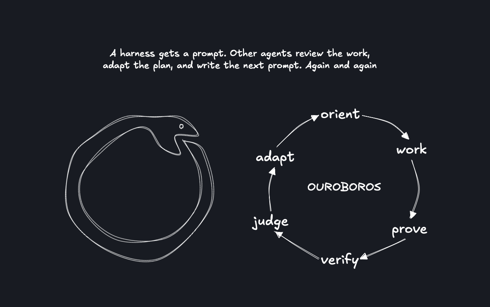

# Ouroboros

Run Claude Code, Codex, or Pi on a repo indefinitely. You set the goal; agents
make changes, check the work, and update the plan. Ouroboros keeps a record.



## Install

You need Python 3.12+, `uv`, `tmux`, and at least one agent CLI installed
and logged in: `claude`, `codex`, or `pi`.

```bash
git clone https://github.com/theo-kirby/ouroboros.git
cd ouroboros
uv tool install --editable .
ouroboros skills install --user
```

## Run

From the repo you want the agents to work on:

```bash
ouroboros init                 # create the config and goal template
ouroboros design               # work through your goal with an agent
ouroboros run --for 8h         # start in tmux
ouroboros top                 # watch progress
ouroboros stop                # stop early if needed
ouroboros report              # write a run report
```

Start with a clean working tree and a completed goal. Run `ouroboros` with
no arguments for an interactive menu.

Your goal lives in `.ouroboros/goal.md`, called the **charter**. It defines
what to build, the constraints, and what counts as done. Agents adapt their
plan as they learn, but cannot edit the charter.

## The loop

- **Actor:** picks one task, does the work, tests it, and records the result.
  When the memory says a reconcile is due, its next iteration is housekeeping.
- **Critic:** one read-only call after every actor turn. It reviews the change
  against the quality bar, answers the actor's questions as you would, refuses
  claims of completion that do not hold up, names loops, and writes the message
  the next iteration starts from. Rejected changes are reverted by default.

Two more roles exist and are off by default: a **maintainer** that runs the
reconcile pass as a separate call, and a **planner** that writes bets into a
plan. Turn them on in the config if the memory rots or the plan drifts.

If an agent hits a usage limit, Ouroboros switches to a configured fallback
or waits for access to return. Set roles and limits in `.ouroboros/config.yml`:

```yaml
roles:
  actor: { harness: claude, timeout: 90m, fallback: [{ harness: codex }] }
  critic: { harness: codex, timeout: 10m, fallback: [{ harness: claude }] }
stop: { after: 8h, max_usage: 0.8 }
```

Dollars are the wrong meter for a subscription, which charges a flat fee and then
rations by window. So a run meters whatever its harnesses actually report: windows
for Claude Code and Codex, dollars for a harness on an API key. `max_usage` is a
fraction of a subscription's **weekly** window, because a five-hour window refills
on its own and the fallback covers the wait. `ouroboros status` and the report show
where each window sits and how far the run moved it.

## Memory and review

By default, agents leave handoff files. Repos with `.hypergraph/config.yml`
use [hypergraph-protocol](https://github.com/theo-kirby/hypergraph-protocol)
for shared state and planning. Install it with `uv tool install hypergraph-protocol`.

Review the report and run branch before merging. Use a merge commit for
hypergraph runs: their records reference commit IDs, which squash and rebase change.

A run reports what it spent as the windows it burned, never as dollars: a
subscription's `total_cost_usd` is priced from token counts at API list rates
and is not your bill. Dollars appear only for a harness on an API key, which
has no windows and a real invoice.

## Development

```bash
uv run pytest -q
```

Role prompts live in `src/ouroboros/skills/`. See [DESIGN.md](DESIGN.md) for
the design, decisions, and lessons from real runs.
